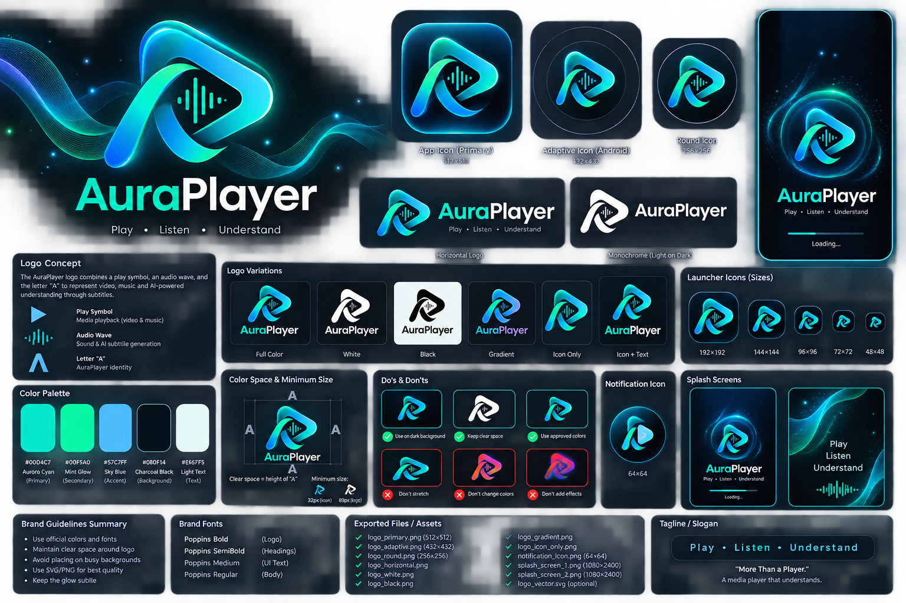

# AuraPlayer Master Design System (Figma-Ready)

Version: 1.0
Status: Design Source of Truth

## AuraPlayer Brand Identity

The official AuraPlayer logo and brand board below are part of the Master Design System and are the visual source of truth for the product.

## Official Brand Board

### Logo Concept

The logo combines three ideas into one recognizable mark:

- **Play Symbol** — represents video and music playback.
- **Audio Wave** — represents sound and AI-powered subtitle generation.
- **Letter 'A'** — creates a unique AuraPlayer identity.

### Official Tagline

> **Play • Listen • Understand**

### Logo Variations

- Primary full-color logo
- Horizontal logo
- Monochrome logo
- Android adaptive app icon
- Round launcher icon
- Notification icon
- Splash screen artwork

### Brand Rules

- Primary color: **Aurora Cyan (#00D4C7)**
- Preserve clear space around the logo.
- Do not stretch or recolor the logo outside the approved palette.
- Keep the subtle glow to reinforce the Spatial UI identity.

---

# Purpose

This document defines AuraPlayer's visual language, components, animations,
and screen inventory before development.

---

# Brand Identity

AuraPlayer is a premium offline AI media player with one signature AI feature:
offline subtitle generation.

Personality:
- Cinematic
- Minimal
- Premium
- Privacy-first

---

# Design Language

UI Style:
Spatial UI

Principles:
- Floating controls
- Layered depth
- Glass-like panels
- Smooth motion
- Content-first

---

# Color System

Background: #0B0F14
Surface: #151A20
Elevated: #1B2129

Primary: #00D4C7
Secondary: #00F5A0

Text Primary: #EDEDED
Text Secondary: #8A8A8A

Status:
Success #32D583
Warning #F59E0B
Error #EF4444

---

# Typography

Font:
Inter

Scale:

Display 34
H1 28
H2 24
H3 20
Body 16
Small 14
Caption 12

---

# Spacing

8pt Grid

Spacing:
8
16
24
32
48

---

# Radius

Cards 24
Buttons 20
Bottom Sheet 28
Chips 16

---

# Shadows

Use subtle layered shadows.

Low:
8% opacity

Medium:
12%

High:
16%

---

# Iconography

Style:
Rounded outline

Sizes:
20
24
28
32

---

# Motion

Duration:
150ms
250ms
350ms

Easing:
Spring

Animations:
- Fade
- Scale
- Slide
- Morph
- Ripple

---

# Component Library

## Buttons

Primary
Secondary
Icon
Floating Action

States:
Default
Pressed
Disabled

---

## Media Card

Contains:
- Thumbnail
- Duration
- Progress
- Title

Supports:
- Video
- Music

---

## Folder Card

Shows:
- Folder icon
- Item count

---

## Seek Bar

Features:
- Glow thumb
- Preview popup
- Chapter markers

---

## Floating Controls

Buttons:
- Previous
- Rewind
- Play
- Forward
- Next

Auto-hide after inactivity.

---

## AI Subtitle Button

Floating circular button.

Tap opens:
- Real-Time
- Generate Subtitle

---

## Bottom Sheets

Types:
- AI Subtitle
- Settings
- Playback
- Subtitle

Height:
40%
70%
90%

---

## Sliders

Used for:
- Volume
- Brightness
- Subtitle size
- Playback speed

---

# Screen Inventory

Total Planned Screens:
64

## Foundation (8)

- Splash
- Onboarding
- Permission
- Empty State
- Error
- Loading
- Update Prompt
- About

## Home (8)

- Home Videos
- Home Music
- Continue Watching
- Favorites
- Recent
- Search
- Folder Browser
- Storage

## Video (14)

- Player Idle
- Player Active
- Locked
- PiP
- Landscape
- Portrait
- Seek Preview
- Gesture Overlay
- Playlist
- AI Subtitle
- Subtitle Settings
- Playback Settings
- Codec Info
- File Info

## Music (10)

- Library
- Album
- Artist
- Playlist
- Now Playing
- Queue
- Shuffle
- Repeat
- Mini Player
- Background Controls

## Settings (12)

- General
- Playback
- Subtitle
- Storage
- Theme
- Notifications
- Permissions
- About
- Licenses
- Diagnostics
- Logs
- Reset

## System States (12)

- No Videos
- No Music
- Permission Denied
- Subtitle Generating
- Subtitle Complete
- Subtitle Failed
- Unsupported Codec
- Corrupted File
- Battery Saver
- Headphones Connected
- Bluetooth Connected
- Storage Full

---

# Video Player Blueprint

Top Bar:
Back
Filename
More

Center:
Video

Bottom:
Floating Controls

Seek Bar:
Glow
Preview
Time

Floating AI Button

---

# Music Player Blueprint

Large Album Art

Floating Controls

Queue Button

Progress Bar

---

# Gesture Map

Left Swipe:
Brightness

Right Swipe:
Volume

Horizontal Swipe:
Seek

Double Tap:
10s Skip

Pinch:
Zoom

Long Press:
Temporary Speed Boost

---

# Accessibility

Touch Targets:
48dp minimum

Subtitle Sizes:
Small
Medium
Large
Extra Large

High Contrast Mode

Screen Reader Support

---

# Microinteractions

Tap:
Ripple

Play:
Button expands slightly.

Subtitle Generation:
Animated waveform.

Seek:
Preview card lifts.

Bottom Sheet:
Elastic spring.

---

# Design Tokens

Create Flutter constants.

Colors:
AppColors.primary
AppColors.background

Radius:
AppRadius.card

Spacing:
AppSpacing.md

Typography:
AppText.body

---

# Developer Handoff Checklist

- Color tokens
- Typography tokens
- Radius tokens
- Icons exported
- Components documented
- Motion timings
- Gesture behavior
- Responsive rules
- Android implementation notes

---

# MVP Lock

The first release includes:

- Spatial UI
- Aurora Cyan branding
- Video playback
- Music playback
- Offline AI subtitle generation
- Real-time subtitles
- No ads
- No cloud

This document becomes the design source of truth before creating the Figma prototype and Flutter implementation.
